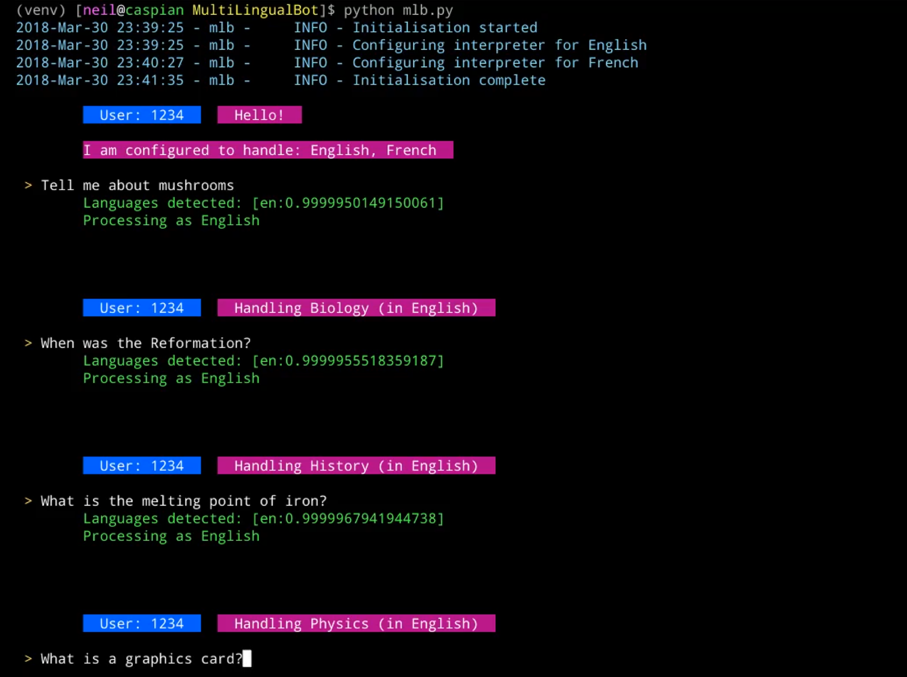

# Background

Basic idea behind this bot is to illustrate multilingual behaviour with a bot, first detecting the language of the user's input and then handling that with the relevant model for that language.  For demonstration purposes, the models classify questions into one of four academic subjects: History, Biology, Physics and Computing.

As it's a proof of concept, the response side is purely to indicate the language and classification, it does not generate full responses.

There is a quick demo of it in action here on YouTube: https://youtu.be/xSN5fY5uYYg

# Installation

**NB:** It is strongly recommended that you use a virtual environment for installation.  See here for details: https://docs.python.org/3/library/venv.html

## With requirements.txt

- pip install -r requirements.txt

## Manual steps

Alternatively you can do the installation steps for Rasa NLU, SpaCy and the project specific packages manually (although this may result in later versions of Rasa NLU / SpaCy being installed)

### Rasa NLU

- pip install rasa_nlu
- pip install rasa_nlu[spacy]

### Spacy models

- python -m spacy download en_core_web_md
- python -m spacy link en_core_web_md en    # not strictly necessary
- python -m spacy download fr_core_news_md
- python -m spacy download de_core_news_sm

### Project specific packages

- pip install click==6.7 colored==1.3.5 langdetect==1.0.7

# How it works

- Create two (or more) equivalent training sets (eg English ("en") and German ("de"))
- Train equivalent models in Rasa NLU
- Set up a simple conversation loop
	- Use langdetect to detect language
	- Direct input to relevant model (eg "en", "fr" or "de")
	- Match intent from the relevant model
	- Customise repsonses to reply appropriately
	**[currently simply indicates topic area and language that reply should be generated in]**

# Performance

You'll notice the script is slow to start as it can take a while to initially load the SpaCy models.

Also it needs a fair amount of RAM (~3Gb), as it will load the SpaCy models for each language, all residing in memory at the same time

Two areas could go wrong:

- language detection
- intent parsing

## Language detection

For an input, it looks through for the languages it is currently working with, taking the first matching language found.

Theoretically could explore more sophisticated handling (eg German was occasionally seen to be mistaken for Dutch or Afrikans), with some kind of similar language grouping feature.  Also langdetect does include probabily scores (they're displayed by not used)

## Intent parsing

This is dependent on the training set (quite limited) and size of the SpaCy models (larger models are generally better).

With casual testing of the bot, overall the English model appears to perform best, followed by the French one and finally by the German. The English SpaCy model uses a web corpus which may give it the edge of the news corpuses used for French and German.  German is a small model compared to the other two, which may explain why it does less well.